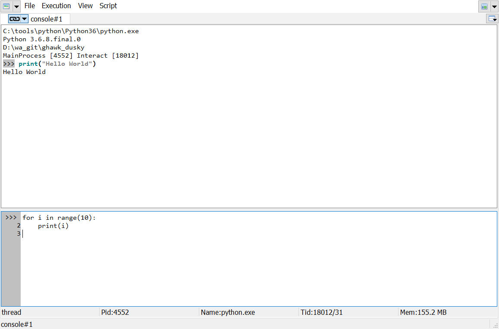

The Console panel: a Python interpreter
=======================================

    A console panel of Gamma Desk.

Usage
-----
Using the console widget is quite straightforward. You enter Python code,
press ``ENTER`` to execute it and observe the return value and/or print
statement output in the output window.
To work conveniently several improvements have been made over
a standard Python interpreter. You are highly encouraged to try these out
for yourself:

    - Multiline input:

      - When typing Python code, hit ``SHIFT+ENTER`` to start at a new line
        without executing the previous line.
        
      - To execute a multiline piece of code hit ``CTRL+ENTER`` with your
        cursor anywhere in your code. Alternatively, you can end your code
        with an empty line and hit ``ENTER``.
        
      - If you hit ``ENTER`` on a single line of code, but more lines are expected,
        a line line is started.

    - Basic auto completion:
    
      - To know what functionality and properties any specific object provides,
        you type the name of the variable that holds that object followed by
        a dot (``.``) and then hit ``TAB``. For example: ``gui.`` + ``TAB``.
        This show all the attributes of ``gui``
        
      - You can filter the results by typing the one or more prefix characters and then
        hit ``TAB``. For example: ``gui.s`` + ``TAB``
        This shows all the attributes of ``gui`` starting with ``s``
        
      - This autocompletion level is case sensitive.
      
      - Attributes which are callable ends with ``(``
      
      - This autocompletion also works for string keys of dictionaries.
        For example: ``shell.ws[`` + ``TAB``.

    - Second-level Autocompletion:

      - This autocompletion is not case sensitive.
      
      - The characters after ``.`` are used for filter on occurrance, not only as prefix
      
      - This autocompletion is started by ``CTRL+TAB``. For exmaple ``gui.roi`` + ``CTRL+TAB`` will
        list all gui attributes containing ``roi``

    - Short hand help function:

      - The standard way of pulling up documentation in Python is through
        the ``help()`` function. In Gamma Desk, you can type a question mark
        after a name (e.g. ``my_var?``) and hit ``ENTER``.
        This will leave ``my_var`` on the prompt but
        print out the documentation. It is syntactic sugar for ``help(my_var)``.
        
    - Edit code:
    
      - The code file is opened with a ``my_function??``. It is syntactic sugar for shell.edit(my_function)
      
      - Which editor executable is used depends on the configuration of Gamma Desk.
      
    - print/show a variable:
    
      Python has by default, 2 methods to make a string representation of an object: 
      
      - The repr() function returns a printable representation of the given object.
        If the user type the object in the command and presses ``ENTER``, this function is called.
        This is the default behavior of Pytyhon
        
      - The str() function gives typical a more extended string. print() will use this function.
      
      - There is a Python module pprint (Pretty Print) to give a cleaner print of list, dictionaries,...
        The actual printed output depends on how well the pretty print module recognize the object.
        It is will suited for nested dictionaries and lists.
        
      - ``my_object!`` is syntactic sugar for ``print(my_object)``. So if you want to have the repr() of the object,
        you just type the object + ``ENTER``. If you want to have the str() of the object, you type object + ``!`` + ``ENTER``.
        
      - ``my_object!!`` is syntactic sugar for ``pprint.pprint(my_object)``
      
    - DOS commands:
    
      - ``!my command`` is equivalent for ``shell.popen(r"""my command"")`` and will
        execute the command in DOS. For example ``!dir`` will show the content of the
        current directory.
        
      - TO DO: this feature is considered Alpha state.
      
    - Magic commands:
    
      - ``%some string`` is equivalent to shell.magic('some string')
      
        - %pwd: Print current working dir        
        
        - %ls, %dir: List the current dir
        
        - %cd <dir>: Change working dir to <dir>
        
        - %tb: Print latest error
        
        - %info: Print info on the current process and thread
        
        - %who: List the current workspace
      
      - TO DO: this feature is considered Alpha state.
      
      
Execution Control
-----------------

Synchroon Breaking
~~~~~~~~~~~~~~~~~~

This method makes use of the Python debugger to setting the system trace function.
This function is called whenever a new local scope is entered.
Because of this extra call, the total execution time of the user code is affected.
The function can raise a custom Error SyncBreaked to interrupt the current flow.

The trace function will be setuped before any executing of user code.

Because this method uses the system tracing, it affect the proper operation of the  Python debugger.

Asynchroon Breaking
~~~~~~~~~~~~~~~~~~~

Sending a KeyBoardInterrupt to the execution thread.
The receiving thread have to step to the next Python command to really raise the KeyBoardInterrupt.

System Exit
~~~~~~~~~~~

A controlled exit of the process.

Kill Process
~~~~~~~~~~~~

A hard kill of the process.

Recover a Python blocking thread
~~~~~~~~~~~~~~~~~~~~~~~~~~~~~~~~

Note that for interrupting a Python thread without killing the entire Python interpreter, it is needed 
that the tread does a Python step. If the thread is waiting for example for data on a queue, and the queue
never get feeded, the thread can not be breaked.

One solution is start another thread which you can use the solve the blocking.

