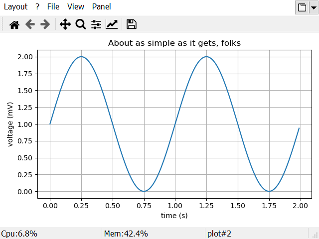
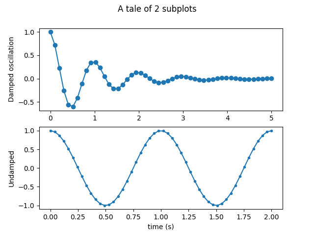
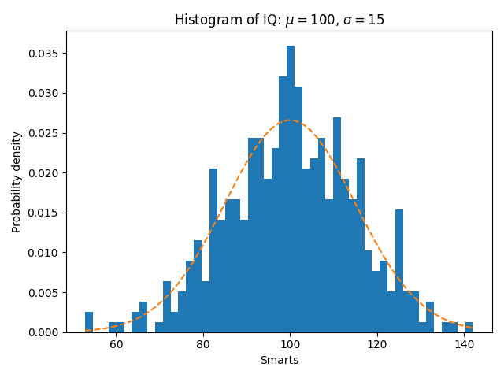

Plots
=====

    Gamma Desk plot panel

Introduction
------------

There a many plotting libraries for Python avaiable, but the most common and easy to use is `Matplotlib <https://matplotlib.org/>`_.

If you want to use Matplotlib in some gui environment, you need a suitable backend for that gui.

This backed is responsible to actual draw the plotting content to screen or to disk.

There are by default backends available for the common gui libraries like Gtk, Qt, Wx.
There are also backends to export to svg or pdf files.

Default backends
~~~~~~~~~~~~~~~~

Note that the default gui backends of Matplotlib have quite some limitations

- plots are created only in the main thread
- There should be no other gui with its own eventloops be running in the same process
  This can be a problem if the Python interpreter is running in another GUI process.

To really integrate the interactive plotting in a gui, a customized backend is needed.

Gamma Desk Backend
~~~~~~~~~~~~~~~~~~

The Gamma Desk backend features:

- Plotting from main and non main threads
- Plotting from external processes outside the gui and rendering the figure in the gui:

  - channeling the figure object from the external process to the gui process
  - channeling the basic plot commands, the figure is crated in the gui process

There is some Mathlab state-based interface `pyplot <https://matplotlib.org/api/_as_gen/matplotlib.pyplot.html#module-matplotlib.pyplot>`_
to Matplotlib plotting library.

Usecase: Interactive Console in the Gui Process
-----------------------------------------------

Nothing special here. You only have to make sure you use the gdesk backed.
Note that the gdesk backend is already selected at startup of gDesk.

Get a reference to pyplot:

.. code-block:: python

    import matplotlib.pyplot as plt

.. note::

    Although it is note mandatory, I suggest to always use `plt` as variable name for the pylab module.

There are a few alternative methods of importing pyplot.

.. code-block:: python

    #Only import pyplot functions
    #This method is prefered
    import matplotlib.pyplot as plt

    #importing pyplot and also a lot of references to numpy objects
    from matplotlib import pylab as plt

    #or a shorter version (not suitable for every version of Matplotlib)
    import pylab as plt

You can check if indeed, the correct backend is selected.

.. code-block:: python

    plt.get_backend()

::

    'module://gdesk.matplotbe'

Make a very basic plot.

.. code-block:: python

    plt.plot([1,3,7])
    plt.show()

Note that after the plot command, the plot window is shown, but no plot is visible.
The show command will actual show the plot.

To close all figures:

.. code-block:: python

    plt.close('all')

Interactive mode
~~~~~~~~~~~~~~~~

In interactive, every plt command will cause a redraw of the plot.
By default, matplotbe is not started in interactive mode.

.. code-block:: python

    plt.isinteractive()

::

    False

You can enable or disable interactive mode the interactive command:

.. code-block:: python

    plt.interactive(True)

.. note::

    Note that interactive mode can slow down the process a lot.

Switching backend
~~~~~~~~~~~~~~~~~

You can switch to another backend.
Switching the backend will close all figures.

.. code-block:: python

    plt.switch_backend('svg')

.. code-block:: python

    plt.switch_backend('module://gdesk.matplotbe')

Usecase: Interactive Console in an external process
---------------------------------------------------

Method 1: figure channeling
~~~~~~~~~~~~~~~~~~~~~~~~~~~

The figure object is created in the user process.
Then, the figure is sended to the gui to show it.
The backend is svg if the user process is not the gui process.

.. code-block:: python

    plt.get_backend()

::

    'svg'

Make a plot using the svg backend.

::

    import matplotlib.pyplot as plt
    import numpy as np

    # Data for plotting
    t = np.arange(0.0, 2.0, 0.01)
    s = 1 + np.sin(2 * np.pi * t)

    fig, ax = plt.subplots()
    ax.plot(t, s)

    ax.set(xlabel='time (s)', ylabel='voltage (mV)',
           title='About as simple as it gets, folks')
    ax.grid()

Normally you execute here the following `plt.show()` to actual show the plot.
But since there is no gui backend selected, this will not work.

::

    UserWarning: Matplotlib is currently using svg, which is a non-GUI backend, so cannot show the figure.

Send the current figure from this process to Gamma Desk gui process.
The figure is renumbered according the active plots in the gui process.

.. code-block:: python

    gui.plot.show()

It will create a new figure window. If you use the option `hold=True`, the current active plot window will used to
show the figure instead of a new window.

Method 2: By command channeling
~~~~~~~~~~~~~~~~~~~~~~~~~~~~~~~

The commands and arguments are channeled to the gui.
The figure object is created in the gui thread.

.. code-block:: python

    plx = gui.prepareplot()   #reference to the pylab proxy
    plx.plot([1,3,7])
    plx.show()

.. note::

    I suggest to use `plx` as variable name for the pylab proxy to make it clear
    it is not the same as plt which is usual a reference to matplotlib.pyplot.

Because plx is a proxy to the pyplot on the gui process. The following gives the backend
currently used in the gui process.

.. code-block:: python

    plx.get_backend()

::

    'module://gdesk.matplotbe'

This method has some limitations:

- Only the pyplot.<funcs> are available
- Any returned object of the function calls is actual a copy comming from the gui process to the local process

Plotting Examples
-----------------

Simple XY plot
~~~~~~~~~~~~~~

Simple xy plotting using the pyplot proxy

.. code-block:: python

    plx = gui.prepareplot()   #reference to the pylab proxy
    plx.figure()              #only needed if not first plot
    elecs = [0, 100, 200, 300, 400]
    response = [10, 2000, 4000, 6000, 7000]
    plx.plot(elecs, response, '+-')
    plx.grid(True)
    plx.xlabel('Electrons')
    plx.ylabel('Response [DN]')
    plx.title('Response')
    plx.tight_layout()        #cleanup space around plot
    plx.show()

Subplots
~~~~~~~~

Subplots can be generated using subplot() as in the following example:

.. code-block:: python

    import numpy as np
    import matplotlib.pyplot as plt

    x1 = np.linspace(0.0, 5.0)
    x2 = np.linspace(0.0, 2.0)

    y1 = np.cos(2 * np.pi * x1) * np.exp(-x1)
    y2 = np.cos(2 * np.pi * x2)

    fig, (ax1, ax2) = plt.subplots(2, 1)
    fig.suptitle('A tale of 2 subplots')

    ax1.plot(x1, y1, 'o-')
    ax1.set_ylabel('Damped oscillation')

    ax2.plot(x2, y2, '.-')
    ax2.set_xlabel('time (s)')
    ax2.set_ylabel('Undamped')

    gui.plot.show()    #Note that plt.show() can only work if you are currently in the gui process

Histogram
~~~~~~~~~

.. code-block:: python

    import numpy as np
    import matplotlib.pyplot as plt

    np.random.seed(19680801)

    # example data
    mu = 100  # mean of distribution
    sigma = 15  # standard deviation of distribution
    x = mu + sigma * np.random.randn(437)

    num_bins = 50

    fig, ax = plt.subplots()

    # the histogram of the data
    n, bins, patches = ax.hist(x, num_bins, density=True)

    # add a 'best fit' line
    y = ((1 / (np.sqrt(2 * np.pi) * sigma)) *
         np.exp(-0.5 * (1 / sigma * (bins - mu))**2))
    ax.plot(bins, y, '--')
    ax.set_xlabel('Smarts')
    ax.set_ylabel('Probability density')
    ax.set_title(r'Histogram of IQ: $\mu=100$, $\sigma=15$')

    # Tweak spacing to prevent clipping of ylabel
    fig.tight_layout()
    gui.plot.show()

Plotting from independent Python process
----------------------------------------

Make sure Gamma Desk is `installed <install.html>`_ in the relevant Python distribution.

The type of communcations channels depends on if Gamma Desk is started as independent process or child process.

Start Gamma Desk as Indepedent Process
~~~~~~~~~~~~~~~~~~~~~~~~~~~~~~~~~~~~~~

First start a Gamma Desk instance.

Then in the console of the other Python process, execute:

.. code-block:: python

    from gdesk.external.channel import connect_to_gui
    connect_to_gui()

Start Gamma Desk as Child Process
~~~~~~~~~~~~~~~~~~~~~~~~~~~~~~~~~

.. code-block:: python

    from gdesk.external.channel import start_gui_as_child
    start_gui_as_child()

Since the workspace & Process in the Gamma Desk Console is the same,
you can execute the following commands in the console of your choice.

Figure channeling method
~~~~~~~~~~~~~~~~~~~~~~~~

We prepare the figure using the svg backend and send
the figure to the gui process.

.. code-block:: python

    #Use pyplot with svg backend
    import matplotlib.pyplot as plt

    #make a figure object in this thread (svg backend)
    plt.figure()

    #The typical plot commands
    plt.title('My simple example')
    plt.grid()
    plt.plot([1,3,2])
    plt.xlabel('The x-axis title')
    plt.ylabel('The y-axis title')

    #Send to the current figure to the gdesk gui process
    gui.plot.show()

Command channeling method
~~~~~~~~~~~~~~~~~~~~~~~~~

We actual draw the figure in the gui process.

.. code-block:: python

    #Use gdesk backend in the gdesk gui process
    #return the proxy to pyplot object in the gdesk gui process
    plx = gui.prepareplot()

    #Disable the interactive mode and create a new figure
    plx.ioff()
    plx.figure()

    #The typical plot commands
    plx.title('My simple example')
    plx.grid()
    plx.plot([1,3,2])
    plx.xlabel('The x-axis title')
    plx.ylabel('The y-axis title')

    plx.show()

The gui is a mapping to the gui proxy instance registered for the current thread.
The gui will be None if accessed from unregistered thread.

Issues
------

Starting a Matplotlib GUI outside of the main thread will likely fail
~~~~~~~~~~~~~~~~~~~~~~~~~~~~~~~~~~~~~~~~~~~~~~~~~~~~~~~~~~~~~~~~~~~~~

::

    UserWarning: Starting a Matplotlib GUI outside of the main thread will likely fail.

A Matplotlib backend is usualy not suitable to plot from outside the GUI thread.
The Matplotlib base backend warns for this, but the warning is surpressed for the gdesk backend.

To check which is the current backend. The current backend in the GUI process should be `module://gdesk.matplotbe`.
Outside the GUI process, it should be NOT `module://gdesk.matplotbe`.

.. code-block:: python

    import pylab
    pylab.get_backend()

::

    'module://gdesk.matplotbe'

Matplotlib is currently using svg, which is a non-GUI backend, so cannot show the figure
~~~~~~~~~~~~~~~~~~~~~~~~~~~~~~~~~~~~~~~~~~~~~~~~~~~~~~~~~~~~~~~~~~~~~~~~~~~~~~~~~~~~~~~~

::

    UserWarning: Matplotlib is currently using svg, which is a non-GUI backend, so cannot show the figure.

You are probably not on the gui process. You have to send the figure to the gui process.
Try `gui.plot.show()` instead of plt.show()`

Fonts are too small
~~~~~~~~~~~~~~~~~~~

Increase the value of plt.rcParams['font.size'] before making a plot

